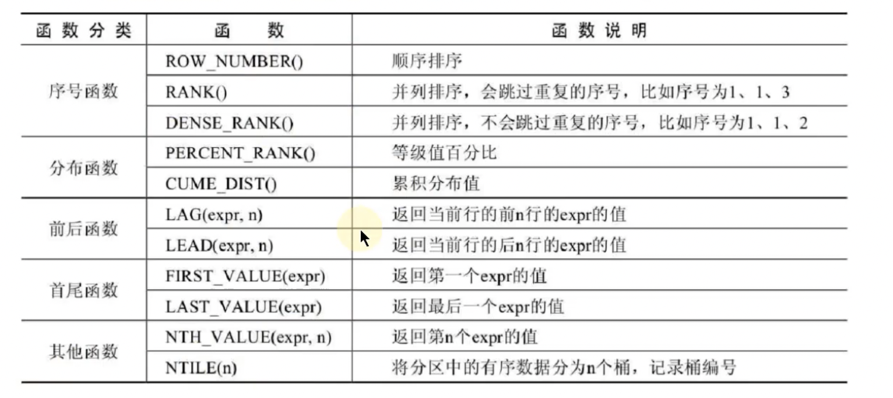

## MySQL基础

### 一.数据库概述与MySQL安装

#### 1.数据库概述

>  DB(数据库)：存储数据的仓库，本质是一个文件系统，保存了一系列有组织的数据。

> DBMS(数据库管理系统)：一种操纵和管理数据库的大型软件，用于建立，使用和维护数据库，对数据库进行统一管理和控制。用户通过数据库管理系统访问数据库中表内的数据。

> SQL(结构化查询语言)：专门用来与数据库通信的语言。

关系型数据库：关系型数据库模型把复杂的数据结构归结为简单的二元关系。关系型数据库以行和列的形式存储数据。

非关系型数据库：基于键值对存储数据，不需要经过SQL层的解析，性能非常高。

**常见的非关系型数据库:**

-  键值型数据库
  - 通过Key-Value键值的方式来存储数据。键值型数据库典型的使用场景是作为内存缓存。最流行的键值型数据库是Redis。
- 文档型数据库
  - 文档型数据库可存放并获取文档，可以是XML,JSON等格式。在数据库中文档作为处理信息的基本单位，一个文档就相当于一条记录。最流行的文档型数据库是MongoDB,CouchDB。
- 搜索引擎数据库
  - 核心原理是"倒排索引"。典型产品：Elasticsearch，Solr，Splunk等。
- 列式数据库
  - 列式数据库是将数据按照列存储到数据库中，好处是可以大量降低系统的I/O,适用于分布式文件系统，不足之处在于功能相对有限。典型产品：HBase等。
- 图形数据库
  - 典型产品：Neo4J，InfoGrid等。

NoSQL使用场景：日志收集，排行榜，定时器等。	


> E-R模型中最重要的概念：实体集，属性，联系集。
>
> 表的四种关联关系：一对一关联，一对多关联，多对多关联，自我引用

#### 2.MySQL环境安装

查看编码命令:

> show variables like 'character_%';
>
> show variables like 'collation_%';

对于MySQL5.7版本来说，字符集默认是latin1,故需要修改My.ini配置文件中的字符集为utf-8。


由于MySQL8.0之前的版本中的加密规则是mysql_native_password,而在MySQL8.0之后，加密规则是caching_sha2_password,所以会出现使用低版本的图形工具连接时会出现连接错误，解决方案有两种:1.升级图形界面工具版本 2.把MySQL8.0用户登录密码加密规则还原成mysql_native_password。

解决方案2的命令:

> USE mysql;
>
> ALTER USER ‘root’@'localhost' IDENTIFIED WITH mysql_native_password BY '密码';
>
> FLUSH PRIVILEGES;

### 二.SQL之select使用

#### 2.1 SQL分类及其规范

SQL分类:

- DDL（Data Definition Languages）：数据定义语言。 CREATE  \  ALTER  \  DROP  \  RENAME  \  TRUNCATE 
- DML（Data Manipulation Languages）：数据操作语言。  INSERT  \ DELETE  \  UPDATE  \  SELECT
- DCL（Data Control Languages）：数据控制语言。 COMMIT  \  ROLLBACK  \  SAVEPOINT  \  GRANT  \  REVOKE

**SQL语言的规则**

- 字符串，日期时间类型的变量需要使用一对' '。
- **列的别名，尽量使用双引号（“ ”），而且不建议省略as。**

 **SQL语言的规范**

- MySQL在Windows环境下是大小写不敏感的
- MySQL在Linux环境下是大小写敏感的	
  - 数据库名，表名，表的别名，变量名是严格区分大小写的。
  - 关键字，函数名，列名（或字段名），列的别名（字段的别名）是忽略大小写的。
- 推荐的书写规范：
  - 数据库名，表名，表别名，字段名，字段别名等都小写  
  - SQL关键字，函数名，绑定变量等都大写

导入数据表，表中数据的方式:

1. 命令行使用命令：source 文件的全类名
2. 图形化界面工具

***


列的去重： 在列名前添加DISTINCT关键字,DISTINCT关键字只能放在首个列名前。

空值参与运算时，结果为Null,此时需要引入IFNULL函数进行处理。

显示表结构：使用命令DESCRIBE或DES

***


#### 2.2 运算符

1. 在SQL中，+没有连接的作用，就表示加法运算。会将字符串转换成数值（隐式转换），转换失败，就按0计算。

2. 安全等于运算符（<=>）和等于运算符的作用是相似的，唯一的区别是 <=> 可以用来对NULL进行判断。在两个操作数均为NULL时，其返回值为1而不为NULL，当一个操作数为NULL时，其返回值为0，而不为NULL。
3. 


> %：代表零个或多个不确定的字符
>
> _ ： 代表一个不确定的字符

4. OR可以和AND一起使用，并且AND的优先级高于OR。
5. <>符号表示不等于


#### 2.3 排序与分页 

排序：使用 ORDER  BY  字段名   ASC/DESC  

**列的别名只能在 ORDER BY 中使用，不能在WHERE中使用。**

分页： "LIMIT  偏移量,条目数"

MySQL8.0分页新特性: LIMIT 条目数 OFFSET 偏移量 


#### 2.4 多表查询

> 从sql优化的角度来看，建议在多表查询时，每个字段都指明其所在的表。

***给列起别名和给表起别名的方式不一样***

给列起别名：字段名 as "别名"

给表起别名：表名 表的别名

注意:

- 一旦给表起了别名的话，在SELECT和WHERE中使用到了表名，就一定要使用表的别名，而不能再使用表的原名称

多表查询的分类:

- 角度一：等值连接 | 非等值连接
- 角度二：自连接  |  非自连接         ( 自连接使用的自身的两张表)
- 角度三：内连接 | 外连接

> 内连接：合并具有同一列的两个以上的表的行，结果集中不包含一个表与另一个表不匹配的行
>
> 外连接：两个表在连接过程中除了返回满足连接条件的行以外还返回左（或右）表中不满足条件的行，这种连接被称为左（或右）外连接。没有匹配的行时，结果表中相应的列为NULL。

SQL99语法实现内连接:

​	SELECT ...  FROM ... (INNER)   JOIN  ...  ON ... (JOIN  ...  ON ...  )

SQL 99语法实现外连接:

​	SELECT ... FROM  ... LEFT(RIGHT) JOIN ... ON ...

满外连接:(但MySQL不支持该方式,需要借助UNION关键字来实现)

​	SELCT ... FROM ... FULL JOIN ... ON ...


**UNION的使用**

> 使用UNION关键字，可以给出多条SELECT语句，并将它们的结果组合成单个结果集。**合并时，两个表对应的列数和数据类型必须相同，并且相互对应。**各个SELECT语句之间使用UNION或UNION ALL关键字分隔。

注意：执行UNION ALL语句时所需要的资源比UNION语句少。如果明确知道合并数据后的结果数据不存在重复数据，或者不需要去除重复数据，则尽量使用UNION ALL语句，以提高数据查询的效率。


SQL99新特性 - 自然连接

> NATURAL JOIN ：相等于等值连接，它会自动查询两张表中**所有相同的字段**，然后进行等值连接。
>
> 该方式较传统的等值连接更不灵活，建议使用传统的等值连接。

SQL99新特性 - USING 

​	此新特性是对上面的新特性进行的改进，指定了等值连接时具体的查询表的相同字段的名称。

 	例: SELECT  ... FROM ... JOIN ... ON .... USING (相同字段名称)

《阿里巴巴Java开发手册》

强制：超过三个表禁止使用JOIN。需要JOIN的字段，数据类型要保持绝对的一致。多表关联查询时，保证被关联的字段需要有索引。


#### 2.5 MySQL内置函数

内置函数按照功能进行划分，分为数值函数，字符串函数，日期和时间函数，流程控制函数，加密与解密函数，获取MySQL信息函数，聚合函数等。

##### 1)单行函数

###### 1.数值函数


###### 2.角度与弧度互换函数


###### 3.三角函数


###### 4,指数与对数


###### 5.进制之间的转换函数


###### 6.字符串函数


> 字符串的索引是从1开始的


###### 7.获取日期，时间函数


###### 8.日期与时间戳的转换函数


###### 9.获取月份，星期，星期数，天数等函数

 

###### 日期的操作函数


###### 10.时间和秒钟的转换函数


###### 11.计算日期和时间的函数


###### 12.日期的格式化与解析函数


###### 13.流程控制函数


###### 14.加密与解密函数


> 在MySQL8.0以上版本，对PASSWORD(str)，ENCODE(value,password_seed),ENCODE(value,password_seed)三个函数均已弃用。

###### 15.MySQL信息函数


###### 16.其他函数


与ROUND(x,y)函数不同，FORMAT(value,n)函数中如果n的值小于或者等于0，则只保留整数部分。

 ##### 2) 聚合函数

###### 1.常见的聚合函数:

- AVG：只使用于数值类型的字段
- SUM：只使用于数值类型的字段
- MAX
- MIN
- COUNT：计算指定字段在查询结果中出现的个数（**计算指定字段出现的个数时，是不计算NULL值的**）

**以上函数在计算时都不计算NULL值 **                              AVG = SUM / COUNT

MySQL中聚合函数是不能嵌套使用的

> 统计表中的记录数，使用count(*),count(1),count(具体字段)哪个效率比较高?	

​	如果使用的是InnoDB存储引擎，则三者效率为  count(*)  = count(1) > count(字段)

**count(*)会统计值为null的行，而count(字段)则不会统计值为null的行**

###### 2.group by的使用

- 在使用过程中，需要注意，SELECT中出现的非组函数的字段必须声明在group by中。反之，group by中声明的子弹可以不出现在SELECT中。
- SELECT ... FROM ... WHERE ... GROUP BY ... ORDER BY ... LIMIT ...
- MySQL中GROUP BY 中使用WITH ROLLUP  即 GROUP BY ... WITH  ROLLUP
- 当使用ROLLUP时，不能同时使用ORDER BY子句进行结果排序，即ROLLUP和ORDER BY是相互排斥的。

###### 3.having的使用

> 若果过滤条件中使用了聚合函数，则必须使用HAVING来替换WHERE。
>
>  即开发中，使用HAVING的前提是SQL中使用了GROUP  BY。

​	当过滤条件中有聚合函数时，则此过滤条件必须声明在HAVING中。

当过滤条件中没有聚合函数时，则此过滤条件声明在WHERE中或HAVING中都可以。但是，建议声明在WHERE中。


**WHERE和HAVING的比较:**

1. 从适用范围上来说，HAVING使用范围更广。

   - WHERE可以直接使用表中的字段作为筛选条件，但不能使用分组中的计算函数作为筛选条件；HAVING必须要与GROUP BY配合使用，可以把分组计算的函数和分组字段作为筛选条件。

2. 如果过滤条件中没有聚合函数，这种情况下，WHERE的执行效率要高于HAVING

   - 如果需要通过连接从关联表中获取需要的数据，WHERE是先筛选后连接，而HAVING是先连接后筛选。

   

###### 4. SQL底层执行原理

SELECT语句的执行顺序：

> FROM <left_table>
>
> ON <join_condition>
>
> <join_type> JOIN <right_table>
>
> WHERE <where_condition>
>
> GROUP BY <group_by_list>
>
> HAVING <having_condition>
>
> SELECT
>
> DISTINCT <select_list>
>
> ORDER BY <order_by_condition>
>
> LIMIT <limit_number>


#### 2.6 子查询

编写注意事项:

- 子查询要包含在括号内
- 将子查询放在比较条件的右侧
- 单行操作符对应单行子查询，多行操作符对应多行子查询

**子查询的分类：**

1. 角度一：从内查询返回的结果的条目数方面看
   - 单行子查询   |  多行子查询
2. 角度二：内查询是否被执行多次
   -  相关子查询  |  不相关子查询

关联子查询：如果子查询的执行依赖于外部查询，通常情况下都是因为子查询中的表用到了外部的表，并进行了条件关联，因此每执行一次外部查询，子查询都要重新计算一次。 


相关子查询的执行流程：


##### 多行比较操作符

| 操作符 | 含义                                                     |
| ------ | -------------------------------------------------------- |
| IN     | 等于列表中的**任意一个**                                 |
| ANY    | 需要和单行比较符一起使用，和子查询返回的**某一个值**比较 |
| ALL    | 需要和单行比较符一起使用，和子查询返回的**所有值**比较   |
| SOME   | 实际上是ANY的别名，作用相同，一般常使用ANY               |

> 在SELECT中，除了group by 和 limit 之外，其他位置都可以声明子查询


##### EXISTS 和 NOT EXISTS关键字

使用场景：关联子查询通常也会和EXISTS操作符一起来使用，用来检查在子查询中是否存在满足条件的行。

```sql
-- 查询departments表中，不存在于employees表中的部门的department_id和department_name
select d.department_id,d.department_name
from departments d 
where not exists (select * 
				 from employees e
				 where d.department_id = e.department_id);

```

通常情况下，能够使用IN的多行子查询都可以使用EXISTS关键字来完成


一个场景下既可以使用自连接完成，也可以使用子查询完成，那该使用哪种方式?

> 一般建议使用自连接，因为在许多DBMS的处理过程中，对于自连接的处理速度比子查询快得多。
>
> 子查询实际上是通过未知表进行查询后的条件判断，而自连接是通过已知的自身数据表进行条件判断，因此在大部分DBMS中都对自连接处理进行了优化。


练习题：

```sql
-- 查询平均工资最低的部门信息
select * 
from departments d 
where department_id  = (
	select department_id 
	from employees e2 
	group by department_id 
	having  avg(salary) = (
						select min(avg_salary)  
						from (
								select department_id,avg(salary) "avg_salary"
								from employees e 
								group by department_id
						) t_department_avg_salary
	)
);

-- 查询平均工资最低的部门信息和该部门的平均工资
select d.*,department_avg_salary.avg_salary
from departments d, (
		select department_id,avg(salary) "avg_salary"
		from employees e  
		group by department_id
		order by avg_salary asc 
		limit 0,1
) department_avg_salary
where d.department_id  = department_avg_salary.department_id;

-- 各个部门中，最高工资中最低的那个部门的 最低工资是多少?
select min(salary) 
from employees emp,(
			select e.department_id,max(salary) 
			from employees e  
			group by e.department_id    
			order by max(salary) asc
			limit 0,1
) department_max_salary_min
where emp.department_id = department_max_salary_min.department_id;

```


### 三. DDL

#### 3.1管理 数据库

##### 3.1.1 创建数据库

创建数据库并指定字符集

``` sql
 create database 数据库名 character set 字符集;
```

判断数据库是否已经存在，不存在则创建数据库

```sql
create database if not exists 数据库名;
```

##### 3.1.2 管理数据库

查看当前使用的数据库

```sql 
select database() from dual;
```

查看指定数据库下保存的数据表

```sql
show tables from 数据库名;
```

##### 3.1.3 修改数据库(一般不会使用)

修改数据库字符集

```sql
alter database 数据库名 character set 字符集;
```

##### 3.1.4 删除数据库

```sql
drop database 数据库名;
drop dabase if exists 数据库名;
```

慎用删除操作！！！

删除操作默认是不能回滚的

#### 3.2 表的相关操作

基于现有的表创建表(同时还可以导入数据)

```sql
create table 表名 as select 字段1,字段2 .... from 现有表的表名
```

补充：查询语句中字段的别名，可以作为新创建的表的字段的名称

添加一个字段

```sql
alter table 表名  add  字段名  字段类型 [ first | after 字段名 ] ;
```

修改一个字段（数据类型，长度，默认值）

```sql
alter table 表名 modify  字段名 字段类型(长度)  [default  默认值];
```

重命名一个字段(可以同时对字段长度进行修改)

```sql
alter table 表名 change 原字段名 新字段名 字段类型(长度);
```

删除一个字段

```sql
alter table 表名 drop column 字段名;
```

重命名表

```sql
方式一:

	rename table 原表名 to 新表名;

方式二:

	alter table 原表名 rename to 新表名;
```

删除表(将表结构和表中数据删除，释放表空间)

```sql
drop table [ if exists ] 表名;	
```

清空表(清空表中的所有数据，但表结构保留)

```sql
truncate table 表名;
```

 #### 3.3 DCL中的commit和rollback

> 一旦执行commit操作，则数据就被永久保存到数据库当中，数据无法执行回滚操作。
> 一旦执行rollback操作，可以实现数据的回滚，回滚到最近一次commiit位置

 #### 3.4 truncate table 和 delete from 的区别

相同点：都可以对表中的所有数据进行删除，同时保留表结构

不同点：truncate table 删除表数据后，不可以进行回滚

​				delete from 删除表数据后，可以进行回滚

知识拓展:

> DDL操作一旦操作，便不可以进行回滚(因为一定会执行一次commit操作，而此commit操作不受set autocommit = false的影响)
>
> DML操作一旦操作，可以进行回滚操作，默认情况下是不能进行回滚操作，只有在执行DML操作之前执行了 set autocommit = false 才能进行回滚

#### 3.5 《阿里巴巴Java开发手册》sql部分

- 【参考】truncate table 比delete 速度快，且使用的系统和事务日志资源少，但truncate 无事务且不触发 trigger，有可能造成事故，故不建议在开发代码中使用此语句。

- 【参考】合适的字段存储长度，不但节约数据表空间，节约索引存储，更重要的时提升检索速度。

  - 无符号值可以避免误存负数，且扩大了表示范围。

  

####  3.6 MySQL8.0中DDL的原子化

> 在MySQL8.0版本中，InnoDB表的DDL支持事务完整性，即DDL操作要么成功要么回滚。DDL操作回滚日志写入data dictionary数据字典表mysql.innodb_ddl_log(该表示隐藏的表，通过show tables无法看到)中，用于回滚操作，通过设置参数，可将DDL操作日志打印到MySQL错误日志中。

### 四.DML

#### 4.1 新增数据

方式一：逐条添加数据

```sql
insert into 表名(字段名1,字段名2, ... ) values(字段值1,字段值2, ... ) 
```

一个同时插入多行记录的insert语句等同于多个单行插入的insert语句，但是多行的insert语句在处理过程中效率更高。

方式二：将查询结果插入到表中

```sql
insert into 表名(字段名1,字段名2, ... )
select 字段名1,字段名2, ... 
from 表名
where 条件
```

注意：查询的字段一定要与添加到的表的字段一一对应

#### 4.2 更新数据

```sql
update 表名 set ... where ...
```

#### 4.3 删除数据

```sql
delete from 表名 where ...
```

#### 4.4 MySQL8.0新特性：计算列

> 计算列：某一列的值是通过别栋列计算得来的。

 例：

```sql
create table 表名(
字段1 类型,
字段2 类型,
字段3 generated always as (字段1 + 字段2) virtual  
);
```


### 五.MySQL数据类型

| 类型             | 类型举例                                                     |
| ---------------- | ------------------------------------------------------------ |
| 整数类型         | TINYINT，SMALLINT，MEDIUMINT，INT（或INTEGER），BIGINT       |
| 浮点类型         | FLOAT,DOUBLE                                                 |
| 定点数类型       | DECIMAL                                                      |
| 位类型           | BIT                                                          |
| 日期时间类型     | YEAR，TIME，DATE，DATETIME，TIMESTAMP                        |
| 文本字符串类型   | CHAR，VARCHAR，TINYTEXT，TEXT,MEDIUMTEXT，LONGTEXT           |
| 枚举类型         | ENUM                                                         |
| 集合类型         | SET                                                          |
| 二进制字符串类型 | BINARY，VARBINARY，TINYBLOB，BLOB，MEDIUMBLOB，LONGBLOB      |
| JSON类型         | JSON对象，JSON数组                                           |
| 空间数据类型     | 单值：GEOMETRY，POINT，LINESTRING，POLYGON                   |
|                  | 集合：MULTIPOINT，MULTINESTRING，MULTIPOLYGON，GEOMETRYCOLLECTION |


常见数据类型的属性:


#### 5.1 整数类型

> 从MySQL8.0.17开始，整数数据类型不推荐使用显示宽度属性。

**可选属性：**

- 宽度属性  例：int(10) 
- unsigned   无符号整数
- zerofill   需要配合宽度属性一起使用，当属性值长度小于属性宽度时，用0进行填充

**使用场景：**

- tinyint：一般用于枚举类型

**使用建议**

> 评估使用哪种数据类型时，需要考虑存储空间和可靠性的平衡问题，不过首先应该考虑可靠性问题，然后再考虑如何节省存储空间

#### 5.2 浮点类型

> MySQL存储浮点数的格式为：符号（S），尾数（M）和 阶码（E）。所以，不论有没有符号，MySQL的浮点数都会存储表示符号的部分。

浮点类型，可以加unsigned,但是不会改变数据的范围

浮点类型存在精度误差问题，对于精度要求比较高的数据，建议使用decimal类型进行存储

#### 5.3 定点类型：decimal

> decimal(M,D)的方式表示高精度小数,其中，M被称为精度，D被称为标度。
>
> decimal的最大取值范围和double类型一样，但是有效的数据范围是有M和D决定的。
>
> decimal的字节数是 M + 2 

decimal在MySQL内部是以字符串的格式存储的。

**浮点数 与 定点数**

- 浮点数相对于定点数的优点是在长度一定的情况下，浮点类型取值范围大，但是不精准，**适用于需要取值范围大，又可以容忍微小误差的科学计算场景**
- 定点数类型的取值范围相对小，但是精准，**适用于对精度要求极高的场景**，比如设计金额计算的场景

#### 5.4 位类型：bit

​	bit类型中存储的是二进制。

#### 5.5 日期与时间类型

##### 5.5.1 year类型

year类型用来表示年份，只需要1个字节的存储空间

- 4位字符串或数字格式表示year类型，其格式为YYYY
- 2位格式的year不推荐使用

##### 5.5.2 date类型

date类型表示日期，没有时间部分，格式为YYYY-MM-DD,需要3个字节的存储空间

##### 5.5.3 time类型

time类型用来表示时间，不包含日期部分，格式为HH:MM:SS,需要3个字节的存储空间。

#####  5.5.4 datetime类型

 datetime类型在所有的日期时间类型中占用的存储空间最大，总共需要8个字节的存储空间，格式为YYYY-MM-DD HH:MM:SS 

##### 5.5.5 timestamp类型

timestamp类型也可以表示日期时间，格式也是YYYY-MM-DD HH:MM:SS ，但只需要4个字节的存储空间，只能存储" 1970-01-01 00:00:01UTC" 到 "2038-01-19 03:14:07 UTC"之间的时间，其中，UTC表示世界标准时间

> 存储数据的时候需要对当前时间所在的时区进行转换，查询数据的时候再将时间转换回当前的时区。所以，使用timestamp存储的同一个时间值，在不同的时区查询时会显示不同的时间。

##### 5.5.6 timestamp 和 datatime 的区别

- Timestamp存储空间比较小，表示的日期时间范围也比较小
- 底层存储方式不同，timestamp底层存储的是毫秒值，距离1970-1-1 0:0:0 毫秒的毫秒值
- 两个日期比较大小或日期计算时，timestamp更方便，更快
- timestamp和时区有关，timestamp会根据用户的时区不同，显示不同的结果。而datetime则只能反映出插入时当地的时区，其他时区的人查看数据必然会有误差的。

##### 5.5.7 日期时间类型在开发中的应用

开发中，用得最多的日期时间类型，就是datetime。此外，一般存注册时间，商品发布时间等，不建议使用datetime存储，而是使用时间戳，原因是datetime虽然直观，但不便于计算。

#### 5.6 文本字符串类型

##### 5.6.1 char和varchar 

- **varchar(M)定义时，必须指定长度M，否则报错。**

- MySQL4.0版本以下，varchar(20),指的是20字节；MySQL5.0版本以上，varchar(20)，指的是20字符。

> char(M)类型，虽然在空间傻上浪费存储空间，但在时间上，效率较高，适用于存储不大，速度要求高的场景。

使用建议：                                                                 
> 在InnoDB存储引擎下，建议使用varchar类型。对于InnoDB数据表，内部的行存储格式并没有区分固定长度和可变长度列(所有数据行都使用指向数据列值的头指针)，而且主要影响性能的因素是数据行使用的存储总量，由于char平均占用的空间多于varchar，所以除了简短并且固定长度的，其他考虑varchar，这样节省空间，对磁盘I/O和数据存储总量比较好。

##### 5.6.2 text类型

text类型的字段不需要预先定义长度。

由于实际存储的长度不确定，MySQL不允许text类型的字段做主键。

开发建议：

​		text文本类型，可以存比较大的文本段，搜索速度稍慢，一般情况下，不建议使用。而且text和blob类型的数据删除后容易导致"空洞"，使得文件碎片比较多，所以频繁使用的表不建议包含text类型字段，建议单独分出去，单独用一个表。

##### 5.6.3 enum：枚举类型

enum类型只允许从成员中选取单个值，不能一次选取多个值。

#### 5.7 二进制字符串类型

MySQL中的二进制字符串类型主要存储一些二进制数据，比如可以存储图片，音频和视频等二进制数据。

实际工作中，往往不会在MySQL数据库中使用blob类型存储大对象数据，通常会将图片，音频和视频文件存储到服务器的磁盘上，并将图片，音频和视频的访问路径存储到MySQL中

text和blob的使用注意事项：

1⃣️ blob和text值会引起自己的一些问题，特别是执行了大量的删除或更新操作的时候，删除这种值会在数据表中留下很大的"空洞"，以后填入这些"空洞"的记录可能长度不同。为了提高性能，建议定期使用optimize table 功能对这类表进行碎片整理。

2⃣️如果需要对大文本字段进行模糊查询，MySQL提供了前缀索引。但是仍然要在不必要的时候避免检索大型的blob或text值。例如：select * 查询就不是很好的想法，除非你能够确定作为约束条件的where子句只会找到所需要的数据行。否则，你可能毫无目的地在网络上传输大量的值。

3⃣️把blob或text列分离到单独的表中。在某些环境中，如果把这些数据列移动到第二张数据表中，可以让你把原数据表中的数据列转换成固定长度的数据行格式，那么它就是有意义的。这会减少主表中的碎片，使你得到固定长度数据行的性能优势，它还使你在主数据表上运行select * 查询的时候不会通过网络传输大量的blob或text值。

##### 5.8 章节总结

在定义数据类型时，如果确定是整数，就用int；如果是小数，一定用定点数类型decimal(M,D)；如果是日期与时间，就用datetime.

《阿里巴巴java开发手册》之sql部分

- 任何字段如果为非负数，必须是 unsigned
- 【强制】小数类型为decimal，禁止使用float和double
- 【强制】如果存储的字符串长度几乎相等，使用char定长字符串类型。
- 【强制】varchar是可变长字符串，不预先分配存储空间，长度不要超过5000，如果存储长度大于此值，定义字段类型为text，独立出来一张表，用主键来对应，避免影响其他字段索引效率。

### 六.约束

#### 6.1 约束的作用

数据完整性是数据的精确性和可靠性。它是防止数据库中存在不符合语义规定的数据和防止因错误信息的输入输出造成无效操作或错误信息而提出的。

**为了保证数据的完整性，SQL规范以约束的方式对表数据进行额外的条件限制**，从以下四个方面考虑：

- 实体完整性：例如，同一个表中，不能存在两条完全相同无法区分的记录。
- 域完整性：例如，年龄范围0-120
- 引用完整性：例如，员工所在部门，在部门表中要能找到这个部门
- 用户自定义完整性：例如，用户名唯一，密码不能为空等

#### 6.2 约束的分类

约束的分类：

1⃣️角度一： 单列约束 ｜ 多列yueshu

2⃣️角度二：列级约束 ｜ 表级约束

3⃣️角度三：非空约束 ｜ 唯一性约束 ｜ 主键约束 ｜ 外键约束 ｜ 检查约束 ｜ 默认值约束

查看表中约束的命令：

```sql
select * from information_schema.table_constraints
where table_name = 表名称;
```

##### 6.2.1 非空约束：not null

- 非空约束只能出现在表对象的列上，只能某个列单独限定非空，不能组合非空。

- 一个表可以有很多列都分别限定了非空

##### 6.2.2 唯一性约束：unique

唯一约束，允许出现多个空值：null

- 唯一约束可以是某一个列的值唯一，也可以多个列组合的值唯一
- 唯一性约束允许列值为空
- 在创建唯一约束的时候，如果不给唯一约束命名，就默认和列名相同
- **MySQL会给唯一约束的列上默认创建一个唯一索引**

表级约束是在所有列之后添加一行：

```sql
constraint 约束名 unique(约束字段1，约束字段2 ... );
```

在alter table 时添加约束

方式1:

```sql
alter table 表名 add constraint 约束名 unique(字段列表)；
```

方式二：

```sql
alter table 表名 modify 字段名 unique;
```

**复合的唯一性约束**

只要复合字段中有一个字段值不同，则两个行就是不一样的。

**删除唯一性约束**

- 添加唯一性约束的列上也会自动创建唯一索引
- 删除唯一约束只能通过删除唯一索引的方式删除
- 删除时需要指定唯一索引名，唯一索引名就和唯一约束名一样
- 如果创建唯一索引时未指定名称，如果时单列，就默认和列名相同；如果是组合列，那么默认和()中排在第一个的列名相同。也可以自定义唯一性约束名

##### 6.2.3 主键约束：primary key

主键约束相当于唯一约束+非空约束的组合，主键约束列不允许重复，也不允许出现空值。

- **一个表最多只能有一个主键约束**，建立主键约束可以在列级别创建，也可以在表级别上创建
- 如果是多列组合的复合主键约束，那么这些列都不允许为null，并且组合的值不允许重复
- MySQL的主键名总是primary
- 当创建主键约束时，系统默认会在所在的列或列组合上建立对应的主键索引(能够根据主键查询的，就根据主键查询，效率更高)。如果删除主键约束了，主键约束对应的索引就自动删除了。
- 不要修改主键字段的值。因为主键是数据记录的唯一标识，如果修改了主键的值，就有可能会破坏数据的完整性。

删除主键约束

```sql
alter table 表名称  drop  primary key;
```

##### 6.2.4 自增列：auto_increment

- 一个表最多只能有一个自增长列
- 自增长列约束的列必须好似键列（主键列，唯一键列）
- 自增约束的列的数据类型必须是整数类型
- 如果自增列指定列0和null，会在当前最大值的基础上自增；如果自增列手动指定了具体值，直接赋值为具体值

**MySQL8.0新特性：自增变量的持久化**

在MySQL8.0之前，自增主键auto_increment的值如果大于max(primary key)+1，在MySQL重启后，会重置auto_increment=max(primary key) + 1,这种现象在某些情况下会导致业务主键冲突或者其他难以发现的问题。

> 在MySQL5.7中，对于自增主键的分配规则，是由innoDB数据字典内部一个计数器来决定的，而该计数器只在内存中维护，并不会持久化到磁盘中。当数据库重启时，该计数器会被初始化。


> 在MySQL8.0会将自增主键的计数器持久化到重做日主中。每次计数器发生改变，都会将其写入重做日志。如果数据库重启，innoDB会根据重做日志中的信息来初始化计数器的内存值。

##### 6.2.5 外键约束：foreign key

- 从表的外键列，必须引用/参考主表的主键或唯一约束的列
- 在创建外键约束时，如果不给外键约束命名，默认名不是列名，而是自动产生一个外键名，也可以指定外键约束名
- 创建表时就指定外键约束的话，先创建主表，再创建从表
- 删表时，先删从表（或先删除外键约束），再删除主表
- 从表的外键列与主表被参照的列名字可以不相同，但是数据类型必须一样，逻辑意义一致
- 当创建外键约束时，系统默认会在所在的列上建立对应的普通索引，但是索引名是列名，不是外键的约束名
- **删除外键约束后，必须手动删除对应的索引**

创建外键约束

```sql
constraint 约束名 foreign key (外键字段名) references 主表名(主表的主键字段名)
```

**约束等级**

- Cascade方式：在父表上update/delete记录时，同步update/delete子表的匹配记录
- Set null方式：在父表上update/delete记录时，将子表上匹配记录的列设为null，但是要注意子表的外键列不能为not null
- No action方式：如果子表中有匹配的记录，则不允许对父表对应候选键进行update/delete操作
- Restrict方式：同No action，都是立即检查外键约束
- Set default方式：父表中有变更时，子表将外键列设置成一个默认的值，但Innodb不能识别

如果没有指定约束等级，就相当于Restrict方式

对于外键约束，最好采用：on update Cascade  on delete Restrict的方式

**删除外键约束**

1⃣️ alter table 表名 drop foreign key  外键名;

2⃣️ show index from 表名称;   # 查看某个表的索引名

3⃣️ alter table 从表名 drop index 索引名;

**开发中使用建议**

> 在MySQL中，外键约束是有成本的，需要消耗系统资源。对于大并发的SQL操作，有可能会不适合。比如大型网站的中央数据库，可能会因为外键约束的系统开销而变得非常慢。所以，MySQL允许你不使用系统自带的外键约束，在应用层面完成检查数据一致性的逻辑。也就是说，即使你不用外键约束，也要想办法通过应用层面的附加逻辑，来实现外键约束的功能，确保数据的一致性。

阿里开发规范中说到

【强制】 不得使用外键与级联，一切外键概念必须在应用层解决

**外键与级联适用于单机低并发，不适合分布式，高并发集群；级联更新是强阻塞，存在数据库更新风暴的风险；外键影响数据库的插入速度。**


**外键约束不能跨引擎使用**

MySQL支持多种存储引擎，每个表都可以指定一个不同的存储引擎。需要注意的是，外键约束是用来保证数据的参照完整性的，如果表之间需要关联外键，却指定了不同的存储引擎，那么这些表之间是不能创建外键约束的。所以，存储引擎的选择也不完全是随意的。


##### 6.2.6 检查约束：check

MySQL5.7不支持check约束，可以使用check约束，但check约束对数据验证没有任何作用，添加数据时，没有任何错误或警告。MySQL8.0开始支持check约束。

##### 6.2.7 默认值约束：default

为什么不想要null的值？

1⃣️不好比较

2⃣️效率不高。影响提高索引效果。因此，往往在建表时添加 not null default '' 或 default 0

### 七.视图

#### 7.1常见的数据库对象

| 对象                | 描述                                                         |
| ------------------- | ------------------------------------------------------------ |
| 表(table)           | 表时存储数据的逻辑单元，以行和列的形式存在，列就是字段，行就是记录 |
| 数据字典            | 就是系统表，存放数据库相关信息的表。系统表的数据通常由数据库系统维护，程序员通常不应该修改，只可查看 |
| 约束(constraint)    | 执行数据校验的规则，用于保证数据完整性的规则                 |
| 视图(view)          | 一个或多个数据表里的数据的逻辑显示，**视图并不存储数据**     |
| 索引(index)         | 用于提高查询性能                                             |
| 存储过程(procedure) | 用于完成一次完整的业务处理，没有返回值，但可通过传出参数将多个值传给调用环境 |
| 存储函数(function)  | 用于完成一次特定的计算，具有一个返回值                       |
| 触发器(trigger)     | 相当于一个事件监听器，当数据库发生特定事件后，触发器被触发，完成相应的处理 |

#### 7.2 初识视图

- 视图是一张虚拟表，本身是不具有数据的，占用很少的内存空间
- 视图是建立在已有表的基础上，视图赖以建立的这些表称为基表
- 视图的创建和删除只影响视图本身，不影响对应的基表。但是当对视图中的数据进行增加，删除和修改操作时，数据表中的数据会相应地发生变化，反之亦然。

使用场景：

​	针对小型项目，不推荐使用视图；针对大型项目，可以考虑使用视图

#### 7.3 视图的创建

完整版：

```sql
create [or replace]
[algorithm = {undefined | merge | temptable}]
view 视图名称 [{字段列表}]
as 查询语句
[with | cascaded | local | check option]
```

精简版:

```sql
create view 视图名
as 查询语句
```

#### 7.4 查看视图

方式一：查看表对象和视图对象

```sql
show tables;
```

方式二：查看视图结构

```sql
desc / describe 视图名; 
```

方式三：查看视图的属性信息

```sql
show table status like '视图名';
```

方法四：

```sql
show create view 视图名;
```

#### 7.5 视图的更新

视图的更新，新增，删除操作和表的操作一样

- 要使视图可更新，视图中的行和底层基本表中的行之间必须存在一对一的关系。

> 虽然可以对视图数据进行更新，但总的来说，视图作为虚拟表，主要是方便查询，不建议更新视图的数据。对视图数据的更改，都是通过对实际数据表里数据的操作来完成的。

#### 7.6 修改，删除视图

**修改视图**

方式一：

如7.3中所示

方式二：

```sql
alter view 视图名 as 查询语句;
```

**删除视图**

```sql
drop view 视图名;
```

- 基于视图a，b创建了新的视图c，如果将视图或者视图b删除，会导致视图c的查询失败。这样的视图c需要手动删除或修改，否则影响使用。

#### 7.7 视图的优缺点

优点：

- 简化查询
- 减少数据冗余
- 数据安全
- 适应灵活多变的需求
  - 当业务系统的需求发生变化后，如果需要改动数据表的结构，则工作量相对较大，可以使用视图来减少改动工作量。

- 能够分解复杂的查询逻辑

缺点：

- 维护成本高
  - 如果实际数据表的结构改变了，就需要及时对相关的视图进行相应的维护

### 八. 存储过程与存储函数

> 存储过程和存储函数能够将复杂的SQL逻辑封装在一起，应用程序无须关注存储过程和存储函数内部复杂的SQL逻辑，而只需要简单地调用存储过程和存储函数即可。

####  8.1 存储过程

存储过程，就是一组经过预先编译的SQL语句的封装。

> 存储过程的执行过程：存储过程预先存储在MySQL服务器上，需要执行的时候，客户端只需要向服务器发出调用存储过程 的命令，服务器就可以把预先存储好的这一系列SQL语句全部执行。


**存储过程和视图，存储函数的区别**

- 存储过程和视图有着同样的优点，清晰，安全，还可以减少网络传输量。不过它和视图不同，视图是虚拟表，通常不对底层数据表直接操作，而存储过程是程序化的SQL，可以直接操作底层数据表，相比于面向集合的操作方式，能够实现一些更复杂的数据处理。
- 一旦存储过程被创建出来，使用它就像使用函数一样简单，我们直接通过调用存储过程名即可。相较于存储函数，存储过程是没有返回值的。

##### 8.1.1 存储过程的分类

存储过程的参数类型可以是in ,out 和inout.主要分为以下几类：

- 没有参数（没有参数没有返回）
- 仅仅带in类型（有参数无返回）
- 仅仅带out类型（无参数有返回）
- 既带in又带out（有参数有返回）
- 带inout（有参数有返回）

##### 8.1.2 存储过程的创建

```sql
create procedure 存储过程名(in|out|inout 参数名 参数类型)
[characteristics ...]
begin
		存储过程体
end		
```

如果没有定义参数种类，默认就是in

**设置新的结束标签**

​	MySQL默认以;结束

```sql
delimiter  新的结束标记
```

#####  8.1.3 存储过程的调用

```sql
call 存储过程名();
```

##### 8.1.4 存储过程的创建和调用的综合示例

带out的存储过程：

```sql
create procedure 存储过程名(out 参数名 参数类型)
begin	

		select 字段 into 参数名
		
		from 表名
end		
# 调用
call 存储过程名(@参数名)
# 查看变量值

select @变量名
```

注意：参数类型应和select 中字段类型相同

#### 8.2 存储函数

##### 8.2.1 存储函数的创建

```sql
create function 函数名(参数名 参数类型, ...)
returns 返回值类型
[characteristics ...]
begin 
		return (函数体)  # 函数体中肯定有return语句
end  
```

##### 8.2.2 存储函数的调用

```sql
select 函数名(实参列表);
```

存储函数如果不添加函数特性的话，会报错

解决方案：

方式一：添加上必要的函数特性

方式二：

```sql
set global log_bin_trust_function_creators = 1;
```

#### 8.3 存储函数与存储过程的区别

|          | 关键字    | 调用语法            | 返回值            | 应用场景                         |
| -------- | --------- | ------------------- | ----------------- | -------------------------------- |
| 存储过程 | procedure | call 存储过程名()   | 理解为有0个或多个 | 一般用于更新                     |
| 存储函数 | function  | select 存储函数名() | 只能是一个        | 一般用于查询结果为一个值并返回时 |

存储函数可以放在查询语句中使用，存储过程不行。此外，存储过程的功能更加强大，包括能够执行对表的操作(比如创建表，删除表等)和事务操作，这些功能是存储函数不具备的。

#### 8.4 存储过程和存储函数的查看，修改，删除

##### 8.4.1 使用show create 语句查看存储过程和存储函数的创建信息

```sql
show create [procedure | function ] 存储过程名或存储函数名;
```

##### 8.4.2 使用 show status语句查看存储过程和存储函数的状态信息

```sql
show [ procedure | function] status [like 'pattern']; 
```

##### 8.4.3 从information_schema_Routines表中查看存储过程和存储函数的信息

```sql
select * from information_schema_Routines 
where ROUTINE_NAME = '存储过程名或存储函数名' [ and  ROUTINE_TYPE = { PROCEDURE | FUNCTION];
```

##### 8.4.4 修改存储过程或存储函数

对存储过程和存储函数的修改，只是修改相关特性，而不影响存储过程和存储函数功能

```sql
alter { procedure | function } 存储过程名或存储函数名 [characteristic ...]
```

##### 8.4.5 存储过程和存储函数的删除

```sql
drop { procedure | function} [if exists] 存储过程名或存储函数名;
```

#### 8.5 存储过程的优缺点

优点：

- 存储过程可以一次编译多次使用
- 可以减少开发工作量
- 存储过程的安全性强
- 可以减少网络传输量
- 良好的封装性

缺点：

> 阿里开发规范
>
> 【强制】 禁止使用存储过程，存储过程难以调试和拓展，更没有移植性

- 可移植性差
- 调试困难
- 存储过程的版本管理很困难
- 它不适合高并发的场景

### 九.变量，流程控制和游标 

#### 9.1 变量

在MySQL数据库中，变量分为系统变量以及用户自定义变量。

##### 9.1.1 系统变量

系统变量又分为全局系统变量（需要添加global关键字）和会话系统变量（需要添加session关键字）

- 全局系统变量针对所有会话有效，但不能跨重启，重启之后全局系统变量又被赋了默认值
- 会话系统变量仅针对于当前会话有效。会话期间，当前会话对某个会话系统变量值的修改，不会影响其他会话同一个会话系统变量的值

**查看系统变量**

```sql
 -- 查看所有全局系统变量
 show global variables;
 
 -- 查看所有会话系统变量
 show session variables;
 
 
 -- 查看满足条件的部分全局系统变量
 show global variables like '%标识符%';
 
 -- 查看满足条件的部分会话系统变量
 show session variables like '%标识符%';
```

**查看指定系统变量**

MySQL中的系统变量以两个"@"开头

```sql
-- 查看指定的系统变量的值
select @@global.变量名;
 
-- 查看指定的会话变量的值
select @@session.变量名;
```

**修改系统变量的值**

方式一：修改MySQL配置文件，修改MySQL系统变量的值（该方法需要重启MySQL服务，不推荐使用）

方式二：在M有SQL服务运行期间，使用“set”命令重新设置系统变量的值

```sql
-- 修改全局系统变量
# 方式一：
set @@global.变量名 = 变量值;
# 方式二：
set global 变量名 = 变量值;

-- 针对于当前的数据库实例是有效的，一旦重启mysql服务，就失效了

-- 修改会话系统变量
# 方式一：
set @session.变量名 = 变量值;
# 方式二：
set session 变量名 = 变量值;

-- 针对于当前会话是有效的，一旦结束会话，重新建立起新的会话，就失效了
```

##### 9.1.2 用户变量

MySQL中的用户变量以一个‘@’开头

用户变量根据作用范围又分为会话用户变量和局部变量

- 会话用户变量：作用域和会话变量一样，只对当前连接会话有效。以一个‘@’开头
- 局部变量：只在begin和end语句块中有效。局部变量只能在存储过程和存储函数中使用。

**会话用户变量**

会话用户变量的定义

```sql
方式一：
set @用户变量 = 值;
set @用户变量 := 值;

方式二：
select @用户变量 := 表达式 [from 等子句];
select 表达式 into @用户变量 [from等子句];
```

查看会话用户变量的值

```sql
select @用户变量;
```

**局部变量**

- 使用declare声明
- **declare的方式声明的局部变量必须声明在begin中的首行**

局部变量的声明

```sql
declare 变量名 类型 [default 值];  //没有default子句时，初始值为null
```

局部变量的赋值，查看与会话用户变量的使用一样，详见上面会话用户变量部分

##### 9.1.3 会话用户变量和局部变量的比较

|              | 作用域                    | 定义位置            | 语法                      |
| ------------ | ------------------------- | ------------------- | ------------------------- |
| 会话用户变量 | 当前会话                  | 会话的任何地方      | 加@符号，不用指定类型     |
| 局部变量     | 定义它的begin ...  end 中 | begin ... end的首行 | 一般不用加@，需要指定类型 |

#### 9.2 定义条件和处理程序

定义条件是事先定义程序执行过程中可能遇到的问题，处理程序定义了在遇到问题时应当采取的处理方式，并且保证存储过程或存储函数在遇到警告或错误时能继续执行。

##### 9.2.1 定义条件

定义条件就是将一个错误名字和指定的错误条件关联起来。这个名字可以随后被用在定义处理程序的 declare handler 语句中。

定义条件使用declare 语句

```sql
declare 错误名称 condition for 错误码(或 sqlstate 字符串错误码);
```

##### 9.2.2 定义处理程序

使用declare语句

```sql
declare 处理方式 handler for 错误类型 处理语句;
```

- 处理方式:有三种取值：continue，exit，undo
  - continue：表示遇到错误不处理，继续执行
  - exit：表示遇到错误马上退出
  - undo：表示遇到错误后撤回之前的操作。但MySQL中暂时不支持这样的操作。
- 错误类型：有以下六种取值
  - SQLSTATE  ‘字符串错误码’ ：表示长度为5的sqlstate_value类型的错误代码
  - MySQL_error_code：匹配数值类型错误代码
  - 错误名称：表示declare ... condition 定义的错误条件名称
  - SQLWARNING：匹配所有以01开头的SQLSTATE错误代码
  - NOT FOUND：匹配所有以02开头的SQLSTATE错误代码
  - SQLEXCEPTION：匹配所有没有被SQLWARNING或NOT FOUND捕获的SQLSTATE错误代码

#### 9.3 流程控制

流程主要分为三大类：顺序结构，分支结构和循环结构

针对于MySQL的流程控制语句主要有三类。注意：只能用于存储程序

- 条件判断语句：if语句和case语句
- 循环语句：loop ，while 和 repeat 语句
- 跳转语句：iterate和leave语句

**if语句的语法结构：**

```sql
if 表达式1 then 操作1
[ elseif 表达式2 then 操作2 ]...
[ else 操作N ]
end if
```

**case语句的语法结构**

结构1:

```sql
# 类似于switch
case 表达式
when 值1 then 结果1或语句1（如果是语句，需要加分号）
when 值2 then 结果2或语句2（如果是语句，需要加分号）
...
else 结果n或语句n（如果是语句，需要加分号）
end [case] （如果是放在begin ... end 中需要加上case，如果放在select后面不需要）
```

结构2:

```sql
-- 类似于多重if
case 
when 条件1 then 结果1或语句1（如果是语句，需要加分号）
when 条件2 then 结果2或语句2（如果是语句，需要加分号）
... 
else 结果n或语句n（如果是语句，需要加分号）
end [case] （如果是放在begin ... end 中需要加上case，如果放在select后面不需要）
```

**loop语句的语法结构**

```sql
[loop_label:] loop
		循环执行的语句
end loop [ loop_label]		
```

**while语句的语法结构**

```sql
[while_label:] while 循环条件 do
		循环体
end while [while_lable];				
```

**repeat语句的语法结构**

```sql
[repeat_label:] repeat
		循环体的语句
until 结束循环的条件表达式
end repeat [repeat_label]
```

**leave语句**

leave语句可以用在循环语句内，或者以begin和end包裹起来的程序体内，表示跳出循环或者跳出程序体的操作。leave可以理解为break	

leave语句的语法：

```sql
leave 标签名;
```

**iterate语句**

iterate语句只能用在循环语句(loop,repeat和while语句)内，表示重新开始循环，将执行顺序转到语句段开头处。iterate可以理解为continue

iterate语句的语法：

```sql
iterate lable;
```

追加：

> 三种循环都可以省略名称，但如果循环中添加了循环控制语句(leave或iterate)，则必须添加名称

#### 9.4游标

 游标，提供一种灵活的操作方式，让我们能够对结果集中的每一条记录进行定位，并对指向的记录中的数据进行操作的数据结构。游标让SQL这种面向集合的语言有了面向过程开发的能力。

- 游标必须在声明处理程序之前被声明，并且变量和条件还必须在声明游标或处理程序之前被声明。
- MySQL中游标可以在存储过程和存储函数中进行使用

1. 声明游标，使用declare关键字来声明游标

   ```sql
   declare cursor_name cursor for select_statement(查询语句);
   ```

2. 打开游标

   ```sql
   open cursor_name;
   ```

3. 使用游标（从游标中获取数据）

   ```sql
   fetch cursor_name into var_name [, var_name ]...
   ```

   - 游标的查询结果集中的字段数，必须跟into后面的变量数一致

4. 关闭游标

   ```sql
   close cursor_name;
   ```

> 在使用游标的过程中，会对数据进行加锁，这样在业务并发量大的时候，不仅会影响业务之间的效率，还会消耗系统资源，造成内存不足，因为游标是在内存中进行处理的。
>
> 特别要注意在使用完游标之后要进行关闭，这样才能提高系统的整体效率

### 十. 触发器

#### 10.1 触发器的创建

```sql
create trigger 触发器名称
[before | after ] [insert | update | delete]  on 表
for each row
	  触发器执行的语句块;
```

触发器执行的语句块可以是单条Sql语句，也可以是由begin ... end结构组成的复合语句块。

#### 10.2 查看触发器

方式一：查看**当前数据库**的所有触发器的定义

```sql
show triggers;
```

方式二：查看**当前数据库**中某个触发器的定义

```sql
show create trigger 触发器名;
```

方式三：从系统库information_schema的triggers表中查询"salary_check_trigger"触发器的信息

```sql
select * from information_schema.triggers;
```

#### 10.3 删除触发器

```sql
drop trigger 触发器名;
```

#### 10.4 触发器的优缺点

优点：

- 可以保证数据的完整性
- 可以帮助我们记录操作日志
- 可以用在操作数据前，对数据进行合法性检查

缺点：

- 可读性差
- 相关数据的变更，可能会导致触发器出错

### 十一.MySQL8新特性

**MySQL8.0新增特性**

- 更简便的NoSQL支持
  - 优化NoSQL存储功能，不再依赖模式
- 更好的索引
  - 新增了隐藏索引和降序索引
- 更完善的JSON支持
  - 增加了聚合函数JSON_ARRAYAGG()和JSON_OBJECTAGG()操作JSON数据
- 安全和账号管理
  - MySQL8.0中新增了caching_sha2_passoword授权插件，角色，密码历史记录和FIPS模式支持
- InnoDB变化
  - InnoDB是MySQL默认的存储引擎，是事务型数据库的首选引擎，支持事务安全表，支持行锁定和外键。在MySQL8版本中，InnoDB在自增，索引，加密，死锁，共享锁等方面做出了大量的改进和优化，并且支持原子数据定义语言(DDL)，提高了数据安全性，对事务提供了更好的支持。

#### 11.1 窗口函数

需要用到分组统计的结果对每一条记录进行计算的场景下，使用窗口函数更好

> 窗口函数的作用类似于在查询中对数据进行分组，不同的是，分组操作会把分组的结果聚合成一条记录，而窗口函数是将结果置于每一条数据记录中。

窗口函数可以分为静态窗口函数和动态窗口函数。

窗口函数的语法结构是

```sql
函数 over ( [partition by 字段名 order by 字段名 asc | desc]) 
```

或

```sql
函数 over 窗口名 ... window 窗口名 as ( [partition by 字段名 order by 字段名 asc | desc])
```




percent_rank()函数等级值百分比计算公式：(rank - 1) / (rows - 1)

rank的值为使用rank()函数产生的序号，rows的值为当前窗口的总记录数

#### 11.2 公用表表达式

公用表表达式是一个命名的临时结果集，作用范围是当前语句。可以用来替代子查询。

公用表表达式分为普通公用表表达式和递归公用表表达式。

普通公用表表达式的语法结构是

```sql
with cet名称
as （子查询）

select | delete | update 语句;
```


